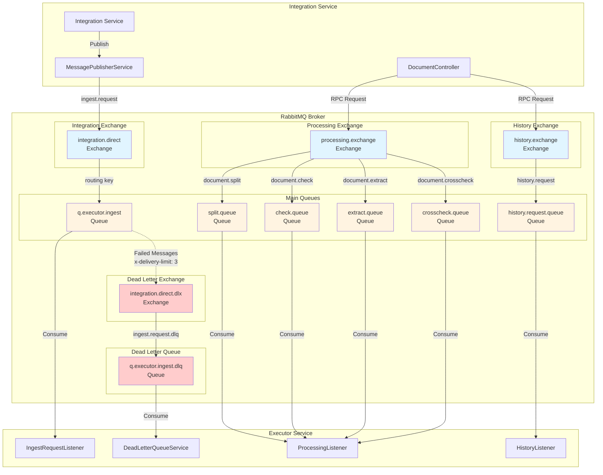
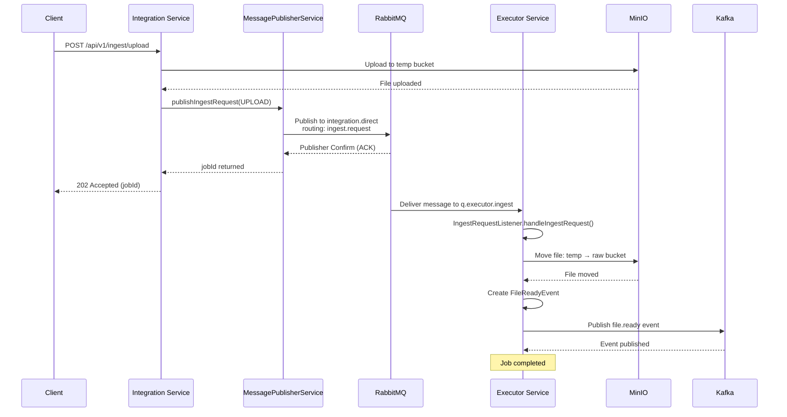
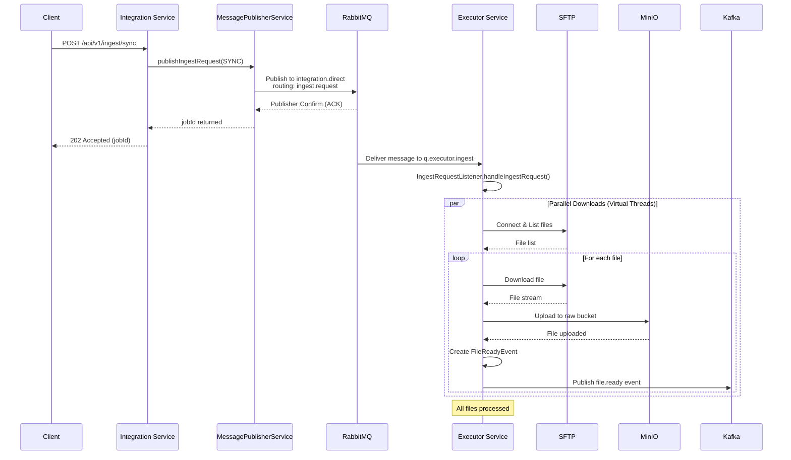
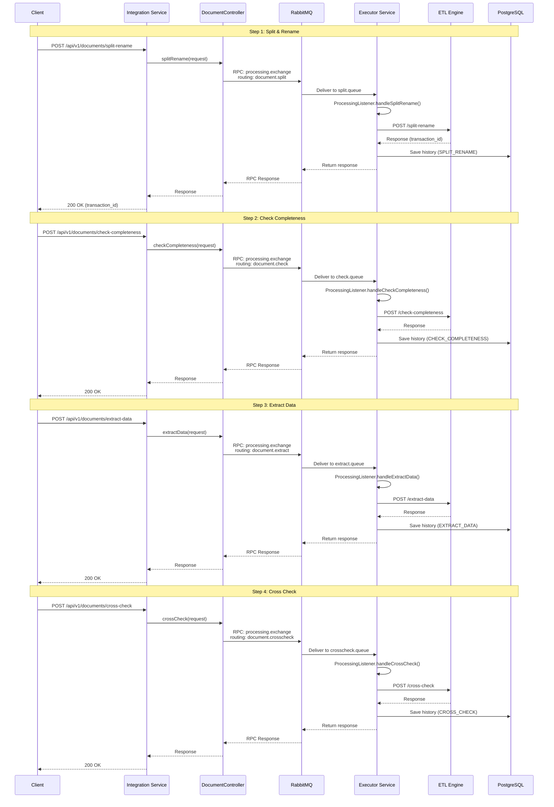
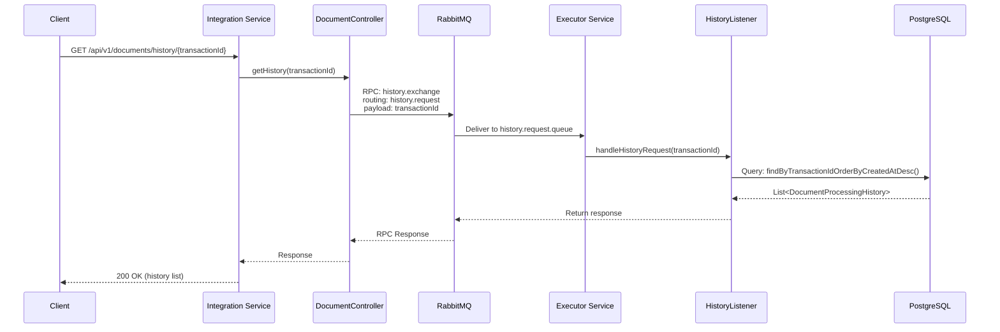
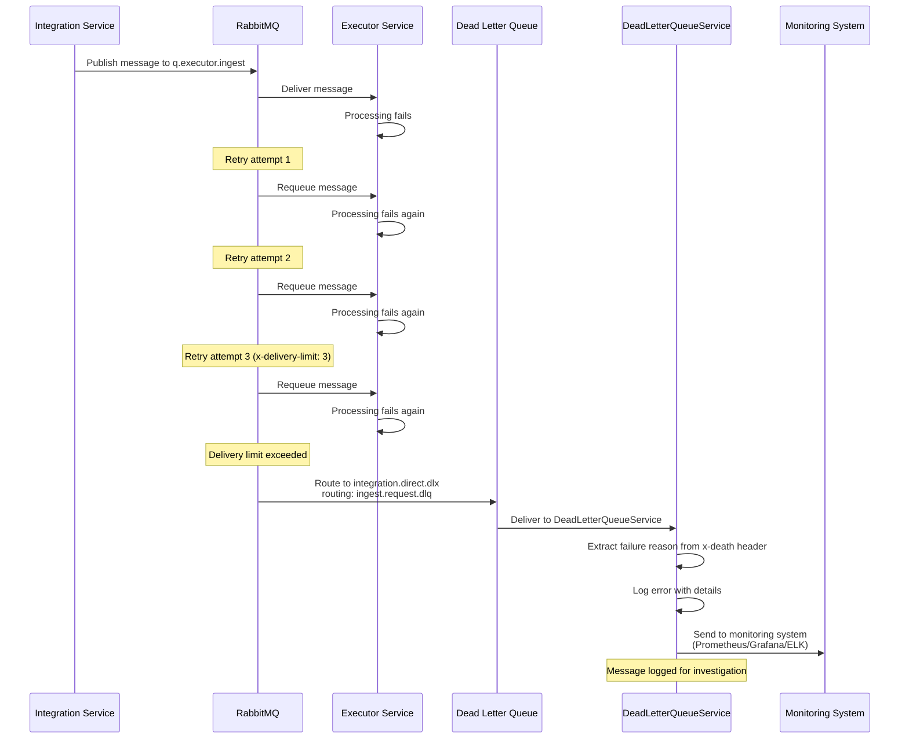

# Kiến Trúc RabbitMQ - Data Extraction System

## Tổng Quan

Tài liệu này mô tả chi tiết kiến trúc RabbitMQ, các exchange, queue, routing key và workflow xử lý message trong hệ thống Data Extraction.

---

## 1. Kiến Trúc Tổng Quan

### 1.1. Các Exchange và Queue

Hệ thống sử dụng **Direct Exchange** với các routing key cụ thể để định tuyến message đến các queue tương ứng.



---

## 2. Chi Tiết Exchange và Queue

### 2.1. Integration Exchange (integration.direct)

**Mục đích**: Exchange chính để gửi ingest request từ Integration Service đến Executor Service.

| Thuộc tính | Giá trị |
|------------|---------|
| Type | Direct Exchange |
| Name | `integration.direct` |
| Durable | `true` |
| Auto-delete | `false` |

**Binding**:
- Queue: `q.executor.ingest`
- Routing Key: `ingest.request`

### 2.2. Processing Exchange (processing.exchange)

**Mục đích**: Exchange để xử lý các tác vụ document processing (RPC pattern).

| Thuộc tính | Giá trị |
|------------|---------|
| Type | Direct Exchange |
| Name | `processing.exchange` |
| Durable | `true` |
| Auto-delete | `false` |

**Bindings**:

| Queue | Routing Key | Mô tả |
|-------|-------------|-------|
| `split.queue` | `document.split` | Xử lý split và rename document |
| `check.queue` | `document.check` | Kiểm tra tính đầy đủ của document |
| `extract.queue` | `document.extract` | Trích xuất dữ liệu từ document |
| `crosscheck.queue` | `document.crosscheck` | Cross-check dữ liệu đã trích xuất |

### 2.3. History Exchange (history.exchange)

**Mục đích**: Exchange để truy vấn lịch sử xử lý document (RPC pattern).

| Thuộc tính | Giá trị |
|------------|---------|
| Type | Direct Exchange |
| Name | `history.exchange` |
| Durable | `true` |
| Auto-delete | `false` |

**Binding**:
- Queue: `history.request.queue`
- Routing Key: `history.request`

### 2.4. Dead Letter Exchange (integration.direct.dlx)

**Mục đích**: Exchange để xử lý các message thất bại sau khi retry.

| Thuộc tính | Giá trị |
|------------|---------|
| Type | Direct Exchange |
| Name | `integration.direct.dlx` |
| Durable | `true` |
| Auto-delete | `false` |

**Binding**:
- Queue: `q.executor.ingest.dlq`
- Routing Key: `ingest.request.dlq`

---

## 3. Chi Tiết Queue Configuration

### 3.1. Main Ingest Queue (q.executor.ingest)

```yaml
Queue Name: q.executor.ingest
Queue Type: quorum (durable)
Dead Letter Exchange: integration.direct.dlx
Dead Letter Routing Key: ingest.request.dlq
Delivery Limit: 3 (retry up to 3 times before DLQ)
```

**Consumer**: `IngestRequestListener.handleIngestRequest()`

**Message Type**: `IngestRequestMessage`
- `jobId`: UUID của job
- `type`: `UPLOAD` hoặc `SYNC`
- `systemId`: ID của hệ thống
- `sourcePath`: Đường dẫn file (cho UPLOAD)
- `sourceConfig`: JSON config (cho SYNC)

### 3.2. Processing Queues

Tất cả các processing queue đều sử dụng **quorum queue** để đảm bảo durability và high availability.

#### 3.2.1. Split Queue (split.queue)

```yaml
Queue Name: split.queue
Queue Type: quorum
Consumer: ProcessingListener.handleSplitRename()
Request Type: SplitRenameRequest
Response: Map<String, Object> (contains transaction_id)
```

#### 3.2.2. Check Queue (check.queue)

```yaml
Queue Name: check.queue
Queue Type: quorum
Consumer: ProcessingListener.handleCheckCompleteness()
Request Type: CheckCompletenessRequest
Response: Map<String, Object>
```

#### 3.2.3. Extract Queue (extract.queue)

```yaml
Queue Name: extract.queue
Queue Type: quorum
Consumer: ProcessingListener.handleExtractData()
Request Type: ExtractDataRequest
Response: Map<String, Object>
```

#### 3.2.4. CrossCheck Queue (crosscheck.queue)

```yaml
Queue Name: crosscheck.queue
Queue Type: quorum
Consumer: ProcessingListener.handleCrossCheck()
Request Type: CrossCheckRequest
Response: Map<String, Object>
```

### 3.3. History Queue (history.request.queue)

```yaml
Queue Name: history.request.queue
Queue Type: quorum
Consumer: HistoryListener.handleHistoryRequest()
Request Type: String (transactionId)
Response: List<DocumentProcessingHistory>
```

### 3.4. Dead Letter Queue (q.executor.ingest.dlq)

```yaml
Queue Name: q.executor.ingest.dlq
Queue Type: quorum
Consumer: DeadLetterQueueService.handleDeadLetter()
Purpose: Log failed messages for monitoring
```

---

## 4. Workflow Chi Tiết

### 4.1. Ingest Workflow - UPLOAD Type

Workflow xử lý file upload từ client.



### 4.2. Ingest Workflow - SYNC Type

Workflow đồng bộ file từ SFTP/S3.



### 4.3. Document Processing Workflow (RPC Pattern)

Workflow xử lý document qua các bước: Split → Check → Extract → CrossCheck.



### 4.4. History Query Workflow (RPC Pattern)

Workflow truy vấn lịch sử xử lý document.



### 4.5. Dead Letter Queue Workflow

Workflow xử lý message thất bại.



---

## 5. Routing Key Mapping

Bảng mapping đầy đủ các routing key và queue tương ứng:

| Exchange | Routing Key | Queue | Consumer | Pattern |
|----------|-------------|-------|----------|---------|
| `integration.direct` | `ingest.request` | `q.executor.ingest` | `IngestRequestListener` | Async |
| `processing.exchange` | `document.split` | `split.queue` | `ProcessingListener` | RPC |
| `processing.exchange` | `document.check` | `check.queue` | `ProcessingListener` | RPC |
| `processing.exchange` | `document.extract` | `extract.queue` | `ProcessingListener` | RPC |
| `processing.exchange` | `document.crosscheck` | `crosscheck.queue` | `ProcessingListener` | RPC |
| `history.exchange` | `history.request` | `history.request.queue` | `HistoryListener` | RPC |
| `integration.direct.dlx` | `ingest.request.dlq` | `q.executor.ingest.dlq` | `DeadLetterQueueService` | Async |

---

## 6. Message Patterns

### 6.1. Async Pattern (Fire-and-Forget)

**Sử dụng cho**: Ingest requests

- **Publisher**: `MessagePublisherService.publishIngestRequest()`
- **Exchange**: `integration.direct`
- **Routing Key**: `ingest.request`
- **Queue**: `q.executor.ingest`
- **Consumer**: `IngestRequestListener.handleIngestRequest()`
- **Publisher Confirms**: Enabled (5s timeout)
- **Circuit Breaker**: Enabled (Resilience4j)

### 6.2. RPC Pattern (Request-Reply)

**Sử dụng cho**: Document processing và history queries

- **Publisher**: `DocumentController` (sử dụng `convertSendAndReceive()`)
- **Exchange**: `processing.exchange` hoặc `history.exchange`
- **Consumer**: `ProcessingListener` hoặc `HistoryListener`
- **Response**: Trả về trực tiếp qua RabbitMQ RPC

---

## 7. Reliability Features

### 7.1. Publisher Confirms

```yaml
Configuration:
  publisher-confirm-type: correlated
  publisher-returns: true
  template.mandatory: true
```

**Implementation**:
- Correlation data được tạo với `jobId`
- Timeout: 5 giây
- Callback logging cho ACK/NACK

### 7.2. Dead Letter Queue

```yaml
Configuration:
  x-dead-letter-exchange: integration.direct.dlx
  x-dead-letter-routing-key: ingest.request.dlq
  x-delivery-limit: 3
```

**Behavior**:
- Message được retry tối đa 3 lần
- Sau 3 lần thất bại → chuyển sang DLQ
- DLQ consumer log chi tiết lỗi cho monitoring

### 7.3. Quorum Queues

Tất cả queue sử dụng **quorum queue type** để đảm bảo:
- Durability
- High availability
- Message replication

### 7.4. Circuit Breaker

**Resilience4j Circuit Breaker** được áp dụng cho:
- `MessagePublisherService.publishIngestRequest()`
- Fallback: Throw exception khi circuit open

---

## 8. Consumer Configuration

### 8.1. Executor Service Consumer

```yaml
spring.rabbitmq.listener.simple:
  concurrency: 5
  max-concurrency: 20
  prefetch: 10
```

### 8.2. Message Converter

Tất cả message sử dụng **Jackson2JsonMessageConverter** để serialize/deserialize JSON.

---

## 9. Monitoring và Observability

### 9.1. Metrics

- Publisher confirms (ACK/NACK)
- Message delivery rate
- DLQ message count
- Processing time per stage
- Error rate

### 9.2. Logging

- Message publish events
- Consumer processing events
- DLQ processing với chi tiết lỗi
- Circuit breaker state changes

---

## 10. Best Practices

1. **Quorum Queues**: Sử dụng cho tất cả queue để đảm bảo durability
2. **Publisher Confirms**: Bật cho tất cả publisher để đảm bảo message delivery
3. **Dead Letter Queue**: Xử lý message thất bại một cách có hệ thống
4. **Circuit Breaker**: Bảo vệ hệ thống khi RabbitMQ không khả dụng
5. **RPC Pattern**: Sử dụng cho synchronous operations (document processing)
6. **Async Pattern**: Sử dụng cho long-running operations (ingest)

---

## 11. Troubleshooting

### 11.1. Message không được consume

- Kiểm tra queue binding
- Kiểm tra routing key
- Kiểm tra consumer đang chạy
- Kiểm tra connection factory

### 11.2. Message vào DLQ

- Kiểm tra x-death header để biết lý do
- Kiểm tra retry count
- Kiểm tra consumer logs
- Kiểm tra ETL service availability

### 11.3. RPC timeout

- Kiểm tra consumer processing time
- Tăng timeout nếu cần
- Kiểm tra ETL service response time

---

## Phụ Lục: Mermaid Scripts

### A.1. Overall Architecture


### A.2. Ingest Workflow - UPLOAD


### A.3. Ingest Workflow - SYNC


### A.4. Document Processing Workflow


### A.5. History Query Workflow


### A.6. Dead Letter Queue Workflow


---

**Tài liệu được tạo tự động từ codebase - Cập nhật: 2024**

