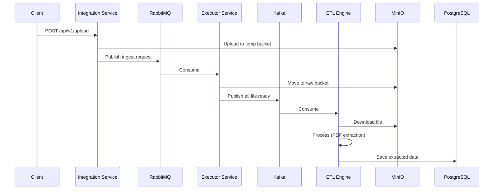

# Data Extraction Pipeline - Implementation Walkthrough

## Overview
This walkthrough documents the implementation of the **Data Extraction Pipeline** based on the hybrid architecture design (Java + Python) specified in `spec.md`.

## Project Structure

```
c:/Project/data-extraction/
├── docker-compose.yml          # Full stack orchestration
├── Makefile                    # Build & run commands
├── .env.example                # Environment template
├── .gitignore
├── infra/
│   └── postgres/
│       └── init.sql            # Database schema
├── data-integration-service/   # [JAVA] Gateway Service
├── data-executor-service/      # [JAVA] Ingestion Service
└── data-etl-engine/            # [PYTHON] Processing Workers
```

---

## Services Implemented

### 1. Integration Service (Java)
**Path**: [data-integration-service](file:///c:/Project/data-extraction/data-integration-service/)

| Component | Description |
|-----------|-------------|
| [IngestController](file:///c:/Project/data-extraction/data-integration-service/src/main/java/com/extraction/integration/controller/IngestController.java) | REST endpoints for file upload and job trigger |
| [RateLimitService](file:///c:/Project/data-extraction/data-integration-service/src/main/java/com/extraction/integration/service/RateLimitService.java) | Redis Lua script for atomic rate limiting (100 req/day) |
| [MinioStorageService](file:///c:/Project/data-extraction/data-integration-service/src/main/java/com/extraction/integration/service/MinioStorageService.java) | File upload to MinIO temp bucket |
| [MessagePublisherService](file:///c:/Project/data-extraction/data-integration-service/src/main/java/com/extraction/integration/service/MessagePublisherService.java) | Publishes to RabbitMQ |

**Endpoints**:
- `POST /api/v1/upload` - Upload file for processing
- `POST /api/v1/job/trigger` - Trigger SFTP/S3 sync job
- `GET /api/v1/quota` - Check rate limit status

---

### 2. Executor Service (Java)
**Path**: [data-executor-service](file:///c:/Project/data-extraction/data-executor-service/)

| Component | Description |
|-----------|-------------|
| [IngestRequestListener](file:///c:/Project/data-extraction/data-executor-service/src/main/java/com/extraction/executor/listener/IngestRequestListener.java) | Consumes from RabbitMQ, handles UPLOAD and SYNC |
| [SftpService](file:///c:/Project/data-extraction/data-executor-service/src/main/java/com/extraction/executor/service/SftpService.java) | SFTP client for downloading files |
| [KafkaProducerService](file:///c:/Project/data-extraction/data-executor-service/src/main/java/com/extraction/executor/service/KafkaProducerService.java) | Publishes `file.ready` events to Kafka |

**Key Features**:
- **Virtual Threads**: Uses `Executors.newVirtualThreadPerTaskExecutor()` for parallel SFTP downloads
- **Dual Messaging**: Consumes from RabbitMQ, produces to Kafka

---

### 3. ETL Engine (Python)
**Path**: [data-etl-engine](file:///c:/Project/data-extraction/data-etl-engine/)

| Component | Description |
|-----------|-------------|
| [main.py](file:///c:/Project/data-extraction/data-etl-engine/src/main.py) | Entry point, Kafka consumer loop |
| [pdf_processor.py](file:///c:/Project/data-extraction/data-etl-engine/src/processors/pdf_processor.py) | PDF text extraction using PyMuPDF |
| [minio_client.py](file:///c:/Project/data-extraction/data-etl-engine/src/storage/minio_client.py) | File download from MinIO |
| [repository.py](file:///c:/Project/data-extraction/data-etl-engine/src/database/repository.py) | Save extracted data to PostgreSQL |

**Key Features**:
- **Kafka Consumer**: Manual offset commit for reliability
- **Processor Router**: Extensible pattern for adding new file type processors

---

## Infrastructure

### Docker Compose Services
| Service | Port | Description |
|---------|------|-------------|
| `postgres` | 5432 | PostgreSQL 15 with init scripts |
| `redis` | 6379 | Cache and rate limiting |
| `rabbitmq` | 5672, 15672 | Message broker (Integration → Executor) |
| `kafka` | 9092 | Stream (Executor → ETL) |
| `minio` | 9000, 9001 | S3-compatible object storage |
| `integration-service` | 8080 | Java Gateway |
| `executor-service` | 8081 | Java Ingestion |
| `etl-engine` | - | Python Workers (2 replicas) |

---

## How to Run

### Start Everything
```bash
cd c:/Project/data-extraction
make up
```

### View Logs
```bash
make logs
```

### Stop
```bash
make down
```

### Start Only Infrastructure (for local dev)
```bash
make infra
```

---

## Data Flow



---

## Files Created

| Category | Count | Key Files |
|----------|-------|-----------|
| Infrastructure | 4 | `docker-compose.yml`, `Makefile`, `.env.example`, `init.sql` |
| Integration Service | 12 | `pom.xml`, `Dockerfile`, controllers, services, configs |
| Executor Service | 11 | `pom.xml`, `Dockerfile`, listener, services, configs |
| ETL Engine | 10 | `requirements.txt`, `Dockerfile`, processors, consumer |

**Total Files Created**: ~37 files
